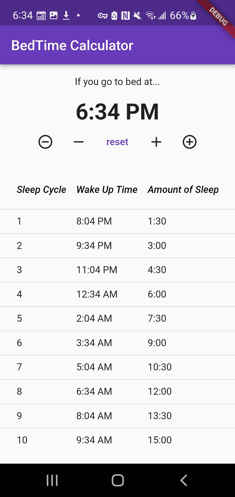

# bedtimes

A simple Flutter app to calculate sleep cycles.

Most other online sleep cycle calculators are a little slow, inconvenient to search for each time, and possibly cintain ads or promotions from the websites (such as mattress companies) that run them.

This is a local-only app intended to be a quick and easy-to-use utility on your home screen.

## Development

### Generating app icons

flutter pub run flutter_launcher_icons:main

### Running

flutter run
